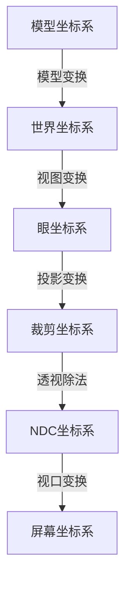
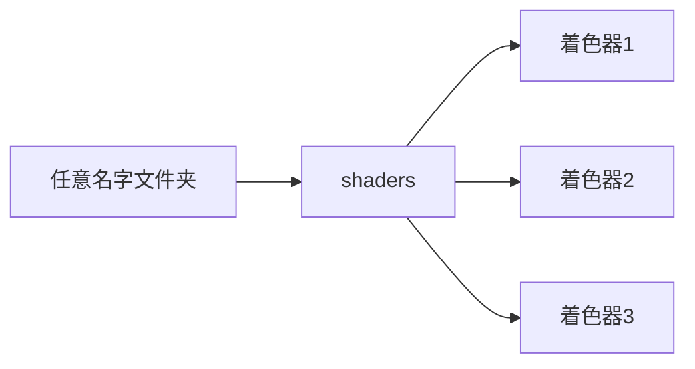
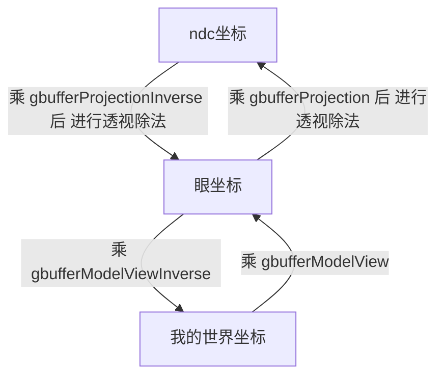

@[TOC](目录)

# 前言
minecraft作为一款知名的沙盒游戏，~~影响了一代人~~ ，我从初中开始玩minecraft，~~一直玩到带学~~ 。

minecraft本身的画质并不好，但是打了shadermod之后，可以达到炸裂般的高画质。shadermod又称光影mod，他需要配合光影包（即一系列的代码）来实现渲染的效果。渲染的效果取决于代码。

小时候，由于家里电脑配置并不好，无法流畅地运行光影mod，于是我开始想办法做“优化”，~~比如尝试删掉光影包里面的一些代码，或者减少其for循环的次数等等~~ 。作为初中生，我无法理解其代码工作原理，当时很好奇，人生中第一次接触的编程语言就是GLSL。

变量，if，循环，在我眼里都很新奇，我尝试改变一个颜色变量的值，于是屏幕变成了对应的颜色，我发现虽然我不会写，但是我能够基于别人写的光影包，做出修改，我敲下第一段代码，来将太阳的颜色做出调整.... 我发现自己对编程有点兴趣 ~~这可能也为我之后选择计算机专业埋下了伏笔~~ 。

基于别人的光影包来修改虽然很方便，但是我还是希望能自己动手编写一个属于自己的光影包。因为当时上初中~~不会编程~~ ，课业繁忙（其实就是自己太菜），一直没能实现这个愿望。到了带学，我逐渐忘记了这个愿望。直到我的hxd [AbysStartdust](http://abyssdust.cn/) 在他的Linux上搭建了一个mc服务器，我才重新玩回mc，想起来自己曾经有这么个愿望，~~正好下学期有图形学的课~~ 遂学glsl。

# 我参考的资料
因为shadermod（光影mod）的参考资料非常少，学习起来非常困难，下面整理一些我经常看的资料：


1. [szszss大神的博客](http://blog.hakugyokurou.net/?p=1364)，<font size=5 color=red>强烈推荐</font> 看他（她？）的博客，非常详细，教科书般的讲解，简直就是shadermod的中文手册+例程代码，对我的帮助非常大，感谢szszss大神！
2. continue团队的教程，全英文生肉，无字幕，当时看的时候可费劲了。。。 这是他的[油管空间](https://www.youtube.com/channel/UCNWdq4iBLWlwbxsEso3392A/videos?sort=dd&shelf_id=1&view=0)  ，有热心hxd把它搬到b站上面来了，这是[b站链接](https://www.bilibili.com/video/BV1jb411C7ri/?p=1)
3. [shadermod的wiki](https://daxnitro.fandom.com/wiki/Editing_Shaders_%28Shaders2%29)，全英文，不过比较简陋，只有一些变量最基本的介绍。。。
4. [wshxbqq的GitHub](https://github.com/wshxbqq/GLSL-Card)，是学习笔记，对GLSL有比较全面的介绍

其中对我帮助最大的要数~~老越共~~ szszss大神的博客，真的太强了！

# 坐标系与坐标变换
在GLSL中，或者说在opengl中，坐标系都是非常重要的东西。有了坐标系，就能够在扁平化的片段着色器中，确定像素的位置，这使得我们可以完成一些复杂的渲染，比如阴影。下面来介绍opengl中常用的坐标系

## 世界坐标系
世界坐标系即**绝对坐标系**，一个顶点在世界坐标系中的位置，不会随着视角或者相机的位置改变而改变。事实上，在任何情况下，一个顶点的世界坐标被确定，那么将永远不会发生变化。

## 模型坐标系

模型坐标系是当前顶点相对于模型而言的坐标系。**模型发生旋转，模型坐标系轴随之转动**。这个坐标系我们在编写着色器的时候不关心，因为总是要通过各种变换把它变换到其他坐标系。


## 眼坐标系

眼坐标系又名相机坐标系，视角坐标系。眼坐标系以摄像机视点中心为原点。和模型坐标系类似，顶点在眼坐标系中的坐标，随着相机（视角）的较度改变而改变。


值得注意的是，眼坐标系中的坐标是**不包含投影变换**的。比如下图中，**红蓝方块位于眼坐标系x轴的相同位置**：


## 裁剪坐标系
裁剪坐标系通过投影而得到。投影的具体方法，就是根据摄像机的 **镜头视场** ，将场景裁剪摄像机 **能够看到** 的部分，然后 **投影** 到摄像机 **镜头** 上


值得注意的是，投影变换只是获得场景中相机的可视部分，**并未做透视除法**，**只是裁剪掉了不可视的部分**，因此名叫裁剪坐标系。

## NDC坐标
NDC坐标又名归一化的设备坐标。裁剪坐标系下的坐标通过 **透视除法** 得到NDC坐标系下的坐标。

> 裁剪坐标通过 **透视除法** 得到NDC坐标。**透视除法** 其实就是裁剪坐标系下的坐标的xyz分量，除以自己的w分量。

透视除法，使得近处的坐标值大，远处的坐标值小。如图，红蓝方块具有**不同**的x轴坐标：


除此之外，NDC坐标的xyz都是`[-1, 1]`这个区间中的。


## 屏幕坐标系
屏幕坐标系中，屏幕左下角为(0, 0)而右上角为(1, 1)。

屏幕坐标由NDC坐标经过**视口变换**而得到，其实就是缩放（乘0.5再加0.5）

值得注意的是，因为由NDC坐标转换而来，屏幕坐标系同样包含了**投影变换**。比如如图的红蓝方块在屏幕坐标系中x轴位置就**不相同**：

## MVP与坐标变换

MVP变换又称：`模型-视图-投影`变换。在着色器中：

1. 顶点的坐标一开始位于模型坐标系，通过`模型（M -- Model）`变换，变换到世界坐标系下
2. 再通过`视图（V -- View）`变换，变换到眼坐标系下
3. 然后通过`投影（P -- Projection）`变换，变换到裁剪坐标系
4. 随后通过`透视除法`变换到NDC坐标系
5. 最后做一个`视口变换`变换到屏幕坐标系

下面的流程图给出了顶点变换的全部流程：



## 在shadermod中的世界坐标

shadermod中的世界坐标和上文提到的世界坐标略有不同，我们称之为 “我的世界坐标” ，是以玩家为中心的坐标。

> 换句话说，相机位置即是 “我的世界坐标” 原点。

使用shadermod提供的视图模型变换矩阵，得到的世界坐标，其实是 “我的世界坐标” 。因为和常理不太相同，故单独提出来。

事实上，之所以转为  “我的世界坐标” 而不是定义上的世界坐标，是因为 “我的世界坐标” 对后续特性的编程实现提供便利。

# GLSL入门
shadermod使用glsl语言编写，想要写shader，我们就必须先了解glsl。glsl类似c语言，常用的数据类型与流程控制，包括结构体，数组等，都有，其中增加mat（matrix矩阵）和vec（vector向量）类型，此外，还有sampler2D（采样器，即纹理）等类型，后面细🔒。

## 面向像素
和图像处理不同，**GLSL编程所操作的对象是每一个像素**，而不是一整张图片，因为GPU是并行计算每个像素的。换句话说，您编写的程序将会对每个像素都运行一遍。

## 顶点与片段着色器
在opengl中，着色器分为两种，分别是顶点着色器（vertex shader）和片段着色器（Fragment shader）。

其中顶点着色器用于处理顶点的坐标变换等几何操作，而片段着色器操作的对象则是颜色缓冲中的二维图像像素，在片段着色器中，所有操作都是基于光栅化（即把三维的点采样到二维图像上）后的图像进行的。

在shadermod中，顶点着色器被命名为`.vsh`文件，而片段着色器为`.fsh`文件。

通常在.vsh文件中，使用 `ftransform()` 函数完成mvp变换，将模型坐标系的坐标变换到屏幕坐标系，然后根据屏幕坐标系中的坐标，通过`texture2D`函数，在二维的纹理上，获取对应的颜色。

## 变量修饰

在声明变量的同上，往往会带上修饰符，比如
```
varying vec4 texcoord;
uniform sampler2D gcolor;
```
这些修饰符都有各自的意义，下面给出修饰符的表格

| 修饰符| 可读 | 可写 | 意义      |
|:--------:| :-------------:|:-------------:|:-------------:|
| uniform  | 是  | 否 | 外部程序传递给shader的变量，一般是变换矩阵啊，纹理啊，坐标啊等等 |
| attribute | 是 | 否 | 和uniform修饰类似，不过只能用在**顶点着色器**中 。在mc中我们用它辨别是何种方块|
| varying | 是 | 是 | 用于顶点着色器和片段着色器之间传递数据的变量，对于双方均可读可写 |


## 向量操作
在glsl中可以轻易的操作向量，比如我们可以创建一个二维向量，它指向(11.4, 5.14)，其他维度的向量同理。
```
vec2 v = vec2(11.4, 5.14);
```
此外，我们还可以通过 `向量.rgba `或 `向量.xyzw `或 `向量.stuv `来获取各个维度的数据，返回结果是对应维度的向量。比如通过下面的语句获取四维向量(1, 1.4, 5, 14)的前两个分量
```
vec4 v = vec4(1, 1.4, 5, 14);
vec2 v1 = v.rg;
vec2 v2 = v.xy;
vec2 v3 = v.st;
// 结果: (1, 1.4)
```
## 矩阵运算
在glsl中还可以将一个矩阵和对应维度的向量相乘，即矩阵乘法，这个相信学过线性代数的童鞋都不陌生 ~~我忘个精光不知道当初怎么拿的A~~ 

```
mat4 m = (1, 2, 3 .... 16);	// 4x4矩阵
vec4 v = (11, 22, 33, 44);
vec4 v = m * v;				// m矩阵乘v向量 矩阵乘法 得到4维向量
```
这个操作，接下来会经常用到，需要用变换矩阵来进行坐标系的转换，比如通过模型视图和投影矩阵完成MVP变换，得到屏幕坐标。值得注意的是，矩阵必须放在左边，而向量放在右边。

## 使用纹理
纹理其实就是一张图片，我们想知道一个顶点的像素RGB值，就得先知道这个顶点在纹理中的坐标，然后使用`texture`函数，将像素值取出来。

值得注意的是，纹理存储的值不一定是像素颜色，也可以是深度数据，光照数据等等，比如在后续的博客中，将使用深度纹理和阴影纹理来绘制阴影。

比如我们有一张二维的纹理名叫 tex， 有一个二维的坐标 vec2 名叫 texcoord，我们可以通过
```
vec3 color = texture2D(tex, texcoord).rgb;
```
来取出对应的颜色。下面的图片演示了这个操作的过程：


值得注意的是，所有纹理查询函数返回值都是vec4，所以要获取颜色的话要加.rgb或者.xyz或者.stu。纹理查询函数不止这一个，但是texture2D是shadermod中最常用的


## 数学帮助函数
GLSL中经常会用到数学操作，所以，常用的数学操作都被内置在GLSL中，比如开平方sqrt，指数exp，sin，cos，幂pow，限幅clamp，min，max等等。。。

所有的帮助函数，可以在[这位大佬的笔记](https://github.com/wshxbqq/GLSL-Card)中找到

## 内置变量
在GLSL中内置一些变量，在渲染的过程中，需要存取这些变量。

| 名称 | 类型      | 解释 |
|:--------:| :-------------:|:-------------:|
| gl_Position | vec4 | 归一化的裁剪空间坐标 范围 [-1, 1] 即顶点转换到屏幕坐标的位置 |
| gl_MultiTexCoord0~7 | vec4 | GLSL内置的 0 号纹理坐标变量，每个纹理单元都有一套，后面的数字对应相应编号的纹理 |
| gl_FragData  | vec4数组 | gl_FragData[i] 表示第 i 个帧缓冲（颜色缓冲区）  |
| gl_TextureMatrix | vec4数组 | 和 gl_MultiTexCoord 配合使用。顶点着色器访问指定的纹理坐标 比如 gl_TextureMatrix[0] * gl_MultiTexCoord0 |
| gl_Vertex | vec4 | 当前像素在模型坐标系中的位置 |
| gl_ModelViewMatrix  | vec4  |  和  gl_Vertex 配合，MV变换的矩阵，即 gl_ModelViewMatrix * gl_Vertex 得到眼坐标系下的坐标|
| gl_ProjectionMatrix | vec4 | 和 gl_ModelViewMatrix 类似，P变换的矩阵，变换后顶点**不需要**做透视除法|
| gl_Color | vec4  | 当前顶点的颜色 |


## DRAWBUFFERS与颜色缓冲区

在shadermod中提供了8个颜色缓冲区。颜色缓冲区用于在不同的着色器之间传递数据。值得注意的是，shadermod的缓冲区`composite`和`final`中可用，除此之外，**默认0号缓冲的颜色最终将被输出**。

比如在terrain.fsh中获取了mc的方块ID，通过向缓冲区写入方块ID，然后在composite.fsh中读取缓冲区数据，即可获得该像素对应的方块ID。

使用 `gl_FragData[]` 以数组赋值的形式向不同的缓冲区输入数据。值得注意的是，无论如何输出数据，`gl_FragData[]`的下标需要从0开始递增，在`/* DRAWBUFFERS */`语句中按照**下标递增**顺序声明要向哪些缓冲去输出数据。

向第 0 3 7 号颜色缓冲区输入数据：

```
/* DRAWBUFFERS 037 */
gl_FragData[0] = xxx;		// 0
gl_FragData[1] = xxx;		// 3
gl_FragData[2] = xxx;		// 7
```

# 光影包结构
一个光影包有如下的结构：先是一个任意名字的文件夹，然后里面有一个shaders的文件夹，再里面就是.fsh / .vsh文件了。



而不同的着色器文件名表示其负责渲染不同的部分，先是通过gbuffer系列的着色器（文件名以gbuffers_打头）的渲染，然后进入composite，按照顺序执行composite1~9，最后由final处理

值得注意的是，glsl着色器有备胎机制，如果缺少当前着色器，则会使用默认的着色器去渲染。~~如果你创建一个文件夹而里面没有任何着色器文件，那么你将看到正常的minecraft画面，因为所有的渲染都交给默认的着色器。~~ 

# 第一个着色器
我们创建一个目录名叫helloworld，然后创建shaders文件夹，在shaders文件夹中添加`composite.vsh`与`compsite.fsh`文件


然后就可以开始编写代码了。。编写如下的代码：

## composite.vsh

在这个顶点着色器中，我们做两件事情：
1. 使用内置函数`ftransform()`得到裁剪空间坐标，并且赋值给 gl_Position （归一化的裁剪空间坐标）
2. 创建名叫 texcoord 的变量，将0号纹理坐标赋值给它，接下来将在片段着色器中使用该变量


```
#version 120

varying vec4 texcoord;

void main() {
	// 为归一化的裁剪空间坐标赋值
    gl_Position = ftransform();	
    
	// 得到当前坐标在0号纹理(即输入图像)上的坐标
    texcoord = gl_TextureMatrix[0] * gl_MultiTexCoord0;	
}
```

## compsite.fsh
在这个片段着色器，作为一个简单的演示，我们不打算实现任何特效，只是**将输入像素直接输出**而已，如果用函数表示，这个片段着色器就是：

```c
int composite(int input)
{
	return input;
}
```


在片段着色器中，我们使用刚刚获得的 texcoord 变量，即0号纹理坐标，也就是主纹理（即默认着色器渲染好的画面）的坐标，然后根据这个坐标，去名叫 texture 的主纹理中取对应的颜色并且输出到0号颜色缓冲（0号颜色缓冲的数据将被最终渲染到屏幕上）


```
#version 120

uniform sampler2D texture;

varying vec4 texcoord;

/* DRAWBUFFERS: 0 */
void main() {
	// 根据坐标获得 texture 纹理中的像素颜色并且输出到0号颜色缓冲
    gl_FragData[0] = texture2D(texture, texcoord.st);
}
```


然后选择对应的helloworld的名称的光影包：


可以看到没有任何的变换，因为我们只是将gbuffer绘制的颜色又重新输出了一遍罢了。

## 简单滤镜特效

现在我们来实现一个小的特效：~~阴间~~ 黑白滤镜

对于每一个像素，我们都进行如下操作
1. 根据其RGB像素值，获取其亮度
2. 用亮度替换其RGB三通道的值

将 compsite.fsh 的内容改为：


```
#version 120

uniform sampler2D texture;

varying vec4 texcoord;

/* DRAWBUFFERS: 0 */
void main() {
    vec4 color = texture2D(texture, texcoord.st);
    float brightness = color.r*0.2 + color.g*0.7 + color.b*0.1;
    gl_FragData[0] = vec4(vec3(brightness), 1.0);
}
```
首先我们将纹理中的颜色取出来，然后我们计算这个像素的亮度，最后将像素亮度作为RGB的值，写入0号颜色缓冲区。

hh现在整个世界变成黑白的了


当然你也可以通过加倍某个颜色通道的值，实现颜色增强的效果。。比如~~看太阳都是绿色的~~ 

# 坐标可视化

在 composite.vsh 中编写如下代码：

```
#version 120

varying vec4 texcoord;

void main() {
    gl_Position = ftransform();
    texcoord = gl_TextureMatrix[0] * gl_MultiTexCoord0;
}
```

我们在 composite.fsh 中编写如下的代码，实现全套坐标变换：

```
#version 120

uniform sampler2D texture;
uniform sampler2D depthtex0;

uniform float far;

uniform mat4 gbufferModelView;
uniform mat4 gbufferModelViewInverse;
uniform mat4 gbufferProjection;
uniform mat4 gbufferProjectionInverse;

varying vec4 texcoord;

/* DRAWBUFFERS: 0 */
void main() {
    vec4 color = texture2D(texture, texcoord.st);

	// 获取当前像素深度
    float depth = texture2D(depthtex0, texcoord.st).x;
    
    // 利用深度缓冲建立带深度的ndc坐标
    vec4 positionInNdcCoord = vec4(texcoord.st*2-1, depth*2-1, 1);

    // 逆投影变换 -- ndc坐标转到裁剪坐标
    vec4 positionInClipCoord = gbufferProjectionInverse * positionInNdcCoord;

    // 透视除法 -- 裁剪坐标转到眼坐标
    vec4 positionInViewCoord = vec4(positionInClipCoord.xyz/positionInClipCoord.w, 1.0);

    // 逆 “视图模型” 变换 -- 眼坐标转 “我的世界坐标” 
    vec4 positionInWorldCoord = gbufferModelViewInverse * positionInViewCoord;

    // color.rgb *= ; // 坐标可视化测试
    
    gl_FragData[0] = color;
}
```
注意这里获取 “我的世界坐标” 的时候，用到了深度缓冲（也是一张纹理，名叫 depthtex0 ）来建立带 z 轴的ndc坐标，随后通过**坐标变换**得到 “我的世界坐标” 。因为变换后的ndc坐标缺乏深度信息，故需要用到深度缓冲。

> 如图，其中 z 轴的值即为深度缓冲中的深度信息，即 2 数字，通过屏幕坐标（xy）加上深度信息（z）以得到三维的 ndc 坐标。


值得注意的是，texcoord的xy轴的值，即为屏幕坐标系的xy值，其中 (0, 0) 在屏幕左下角，(1, 1) 在屏幕右上角，所以通过乘以2再减1将其变为**ndc坐标系下的xy值**。

此外，注意到我们引入了几个 uniform 修饰的矩阵，即坐标变换矩阵

```
uniform mat4 gbufferModelView;
uniform mat4 gbufferModelViewInverse;
uniform mat4 gbufferProjection;
uniform mat4 gbufferProjectionInverse;
```

下面给出 shadermod 中各种坐标的变换（注：“我的世界坐标” 不等于 世界坐标 ）：



## 深度缓冲纹理获取ndc坐标

刚刚提到利用深度缓冲纹理 depthtex0 建立ndc坐标，这里细说一下：

深度缓冲纹理就是一张图片，只是存的不是像素颜色，而是深度值。使用起来和 texture 没区别，使用 `texture2D()` 函数获取纹理中的值

```
// 获取当前像素深度
float depth = texture2D(depthtex0, texcoord.st).x;
```


深度缓冲 rgb 的 r 通道表示该像素在屏幕空间中的深度，范围 [0, 1]，所以将其乘以2再减1，作为ndc坐标的 z 轴。

```
// 利用深度缓冲建立带深度的ndc坐标
vec4 positionInNdcCoord = vec4(texcoord.st*2-1, depth*2-1, 1);
```

举个例子：

将 “坐标可视化测试” 一行的代码改为：

```
color.rgb = vec3(positionInNdcCoord.z);
```


## ndc坐标可视化
在上述代码的 “坐标可视化测试” 一行改为

```
color.rgb *= positionInNdcCoord.x;
```

效果：


可以看到，左侧为黑色，因为左侧的坐标为负数，颜色自动被截断，而右侧颜色从暗到亮，对应x坐标递增到1

## 眼坐标可视化
在上述代码的 “坐标可视化测试” 一行改为

```
color.rgb *= positionInViewCoord.x;
```

效果：


可以看到眼坐标系的坐标是带深度的，说起来比较抽象，看图：


另外，因为眼坐标的值，不是-1到1区间的，所以过亮的部分变成白色（截断了）

## “我的世界坐标” 可视化

**我的世界坐标是原点在摄像机的世界坐标。**

在上述代码的 “坐标可视化测试” 一行改为

```
color.rgb *= positionInWorldCoord.x;
```

效果：


# 小结
这一部分讲了比较多的内容，其中非常重要的是坐标转换的，尤其要注意 “我的世界坐标” 和世界坐标的区别。

更多的内容以及特效的实现将会放在下一篇博客讲解了，篇幅有限 ~~差不多得了😅~~ 

下次讲解基本的阴影的实现方法。