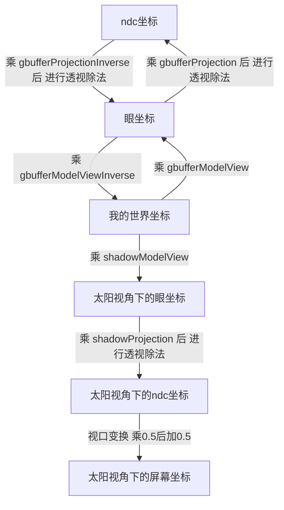

**完整资源：**

 [我的Github地址](https://github.com/AKGWSB/Hello-Minecraft-Shaders/tree/master)


**前情提要：**

[从0开始编写minecraft光影包（0）GLSL，坐标系，光影包结构介绍](https://blog.csdn.net/weixin_44176696/article/details/108152896)

@[TOC](目录)

# 前言

在当了n天的懒狗之后，还是 ~~掘腚~~ 决定填一下坑。。今天来完成咱光影包的第一个特效，也是最基础的特效--阴影绘制

# 阴影实现原理

众所周知，光照到物体上会反射，而光被物体挡住，物体遮蔽的部分就会呈现暗色，这就是阴影。

如图所示：


~~dbq放错图了。。~~ 


已知一个点 P，光源为 O 点 ，如何判断 P 点是否落在阴影中呢？

这里有一个很简单的方法：比较 **P点到光源的距离** 和 **PO连线上离光源最近的实体点到光源的距离**

假设 
1. P 点到光源的距离 = s1
2. **PO 连线**上离光源**最近**的实体点到光源的距离 = s2

如果 s1 > s2 则说明 P 点在阴影中

如图：因为同一直线上，有别的点离光源更近，说明P点被覆盖，故 P 在阴影中。


P点在阴影中，那么我们直接将其涂黑就好了。难点在于如何获取**P点到光源的距离**


# P点到光源的距离
已知一个点 P，光源为 O 点

已知 P 点，要看 P 点是否需要被涂黑，需要计算P点到光源的距离。

在 “太阳的屏幕坐标系”  下，z轴（即深度通道）为该点到太阳的距离。可是我们只知道 P 点在屏幕坐标系中的位置，而如何知道 P 点在 “太阳的屏幕坐标系” 下的位置？

好在 shadermod 提供了变换矩阵作为可用变量。下面给出四个可用的变换矩阵：

```
uniform mat4 shadowModelView;
uniform mat4 shadowModelViewInverse;
uniform mat4 shadowProjection;
uniform mat4 shadowProjectionInverse;
```

值得注意的是，太阳视角下的坐标系，并非opengl的默认坐标系，需要通过 “我的世界坐标” 转换而得到。

> 还记得 “我的世界坐标”  吗？[上一篇博客](https://blog.csdn.net/weixin_44176696/article/details/108152896)提到过。即原点在摄像机处的世界坐标，原点随着摄像机移动而移动。

下面给出各种坐标和**太阳视角下的坐标**的转换关系：



下面给出 “我的世界坐标” 转太阳视角下的屏幕坐标的代码：

```
// P点的 我的世界坐标 注意不是世界坐标。。
vec4 positionInWorldCoord;	

// 我的世界坐标 转 太阳的眼坐标
vec4 positionInSunViewCoord = shadowModelView * positionInWorldCoord;

// 太阳的眼坐标 转 太阳的裁剪坐标
vec4 positionInSunClipCoord = shadowProjection * positionInSunViewCoord;

// 太阳的裁剪坐标 转 太阳的ndc坐标
vec4 positionInSunNdcCoord = vec4(positionInSunClipCoord.xyz/positionInSunClipCoord.w, 1.0);

// 太阳的ndc坐标 转 太阳的屏幕坐标
vec4 positionInSunScreenCoord = positionInSunNdcCoord * 0.5 + 0.5;
```

根据太阳视角下的屏幕坐标的 z 轴，即是 P 点距离太阳（光源）的距离，我们管他叫做 当前距离 currentDepth。

```
float currentDepth = positionInSunScreenCoord.z;    // 当前点的深度
```


解决了P点到光源的距离，还需要计算PO连线上离光源最近的实体点到光源的距离。下面介绍该方法。

# PO连线上离光源最近的实体点到光源的距离
已知一个点 P，光源为 O 点

  为了计算**PO连线上离光源最近的实体点到光源的距离**，这就需要引入 shadow 纹理了。
  
## shadow纹理
shadow纹理是光影mod预先绘制的一张纹理图片，我们可以直接使用`texcoord2D()`查询纹理，而无需对其做任何其他处理。

和深度图类似，shadow纹理存储的数据也是深度，这个深度它描述了 **离光源最近的实体点到光源的距离**，而且是**以光源的视角进行描述**的。听起来很抽象，我们来看这样一张图片：


shadow纹理绘制的图片，是以太阳的视角出发，图片的像素值为 **离光源最近的实体点到光源的距离**。可以看到，近处的山体呈现暗色，说明离太阳距离近，而远处的山体呈现亮色，说明距离远。

注：右图是使用 `vec4 color = texture2D(shadow, texcoord.st);` 直接采样并且输出的shadow纹理的数据

## 获取深度信息

因为shadow纹理绘制的深度信息是以太阳的视角出发，我们需要使用 **P 点在太阳视角下的屏幕坐标** 对shadow纹理进行采样，才能够正确的得到深度的值。

```
 // 太阳视角下的屏幕坐标
vec4 positionInSunScreenCoord;

// 查询纹理，获取 离光源最近的点的深度
float closest = texture2D(shadow, positionInSunScreenCoord.xy).x;   
```


注：对shadow纹理的采样，和第一篇博客中提到的深度纹理的采样无异。只是本次采样需要在太阳视角（或者称之为光照坐标系。。）下进行

# 绘制阴影
已知一个点 P，光源为 O 点

通过上述的步骤，我们获得了
1. P点到光源的距离（当前点深度） currentDepth
2. PO连线上离光源最近的实体点到光源的距离 closest

之后的步骤非常简单了，如果当前点P的深度大于最近点的深度，说明该点在阴影中。我们通过降低颜色的RGB值来涂黑像素

```
// 如果当前点深度大于光照图中最近的点的深度 说明当前点在阴影中
if(closest <= currentDepth) {
    color.rgb *= 0.5;   // 涂黑
}
```

# 着色器编写
编写compsite.fsh 和 vsh


## compsite.vsh
在顶点着色器中，完成对裁剪坐标的赋值

```
#version 120

varying vec4 texcoord;

void main() {
	// 为归一化的裁剪空间坐标赋值
    gl_Position = ftransform();	
    
	// 得到当前坐标在0号纹理(即输入图像)上的坐标
    texcoord = gl_TextureMatrix[0] * gl_MultiTexCoord0;	
}

```

## conpsite.fsh
在片段着色器中，我们编写一个函数，叫做 getShadow。

因为根据上文的分析，我们得到 “我的世界坐标”，就可以通过 shadowModelView 和 shadowProjection 坐标变换矩阵，得到 “太阳视角下的坐标”，进而计算出该点是否需要涂黑

所以 getShadow 的入口参数有两个：
1. 当前像素颜色
2. 当前像素在“我的世界坐标系”下的坐标

此外，getShadow 返回当前像素的新颜色，即涂黑或者不涂黑。


```
#version 120

uniform sampler2D texture;
uniform sampler2D depthtex0;
uniform sampler2D shadow;

uniform float far;

uniform mat4 gbufferModelView;
uniform mat4 gbufferModelViewInverse;
uniform mat4 gbufferProjection;
uniform mat4 gbufferProjectionInverse;

uniform mat4 shadowModelView;
uniform mat4 shadowModelViewInverse;
uniform mat4 shadowProjection;
uniform mat4 shadowProjectionInverse;

varying vec4 texcoord;

/*
 * @function getShadow         : getShadow 渲染阴影
 * @param color                : 原始颜色
 * @param positionInWorldCoord : 该点在世界坐标系下的坐标
 * @return                     : 渲染阴影之后的颜色
 */
vec4 getShadow(vec4 color, vec4 positionInWorldCoord) {
    // 我的世界坐标 转 太阳的眼坐标
    vec4 positionInSunViewCoord = shadowModelView * positionInWorldCoord;
    // 太阳的眼坐标 转 太阳的裁剪坐标
    vec4 positionInSunClipCoord = shadowProjection * positionInSunViewCoord;
    // 太阳的裁剪坐标 转 太阳的ndc坐标
    vec4 positionInSunNdcCoord = vec4(positionInSunClipCoord.xyz/positionInSunClipCoord.w, 1.0);
    // 太阳的ndc坐标 转 太阳的屏幕坐标
    vec4 positionInSunScreenCoord = positionInSunNdcCoord * 0.5 + 0.5;

    float currentDepth = positionInSunScreenCoord.z;    // 当前点的深度
    float closest = texture2D(shadow, positionInSunScreenCoord.xy).x;   // 离光源最近的点的深度

    // 如果当前点深度大于光照图中最近的点的深度 说明当前点在阴影中
    if(closest <= currentDepth) {
        color.rgb *= 0.5;   // 涂黑
    }
    
    return color;
}


/* DRAWBUFFERS: 0 */
void main() {
    vec4 color = texture2D(texture, texcoord.st);

    float depth = texture2D(depthtex0, texcoord.st).x;
    
    // 利用深度缓冲建立带深度的ndc坐标
    vec4 positionInNdcCoord = vec4(texcoord.st*2-1, depth*2-1, 1);

    // 逆投影变换 -- ndc坐标转到裁剪坐标
    vec4 positionInClipCoord = gbufferProjectionInverse * positionInNdcCoord;

    // 透视除法 -- 裁剪坐标转到眼坐标
    vec4 positionInViewCoord = vec4(positionInClipCoord.xyz/positionInClipCoord.w, 1.0);

    // 逆 “视图模型” 变换 -- 眼坐标转 “我的世界坐标” 
    vec4 positionInWorldCoord = gbufferModelViewInverse * positionInViewCoord;

    color = getShadow(color, positionInWorldCoord);
    
    gl_FragData[0] = color;
}
```


保存并且运行，你会看到：


许多错乱的阴影条纹，是因为 P 点经过坐标变换到太阳视角下的坐标系，因为浮点精度不足加上浮点的舍入，难免会有失真。

简单的通过 **z 轴** 和 **shadow纹理中的数据值** 比对，**对于不在阴影中的点，理论上说，他们数值是一样的**，但是因为坐标变换导致的误差，有可能造成误判，解决方案就是在判断条件加一个小的偏移量即可：


现在，阴影能够被正常绘制了。。


# 小结
这一篇终于完成了第一个便宜特效的绘制。。~~摸了~~ 

可以看到咱的阴影还是有很多不足，~~这些不足会在下一章节被修复 摸了~~ ，比如分辨率堪忧，阴影的细节不够还原，史蒂夫都被扭曲成一坨翔了。。。


或者是太阳直射的时候，会因为采样精度不足，产生奇怪的错误绘制：


~~总之。。。算了 咕了~~ 
