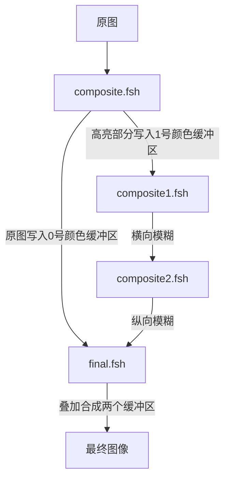

**完整资源：**

 [我的Github地址](https://github.com/AKGWSB/Hello-Minecraft-Shaders/tree/master)

**前情提要：**

[从0开始编写minecraft光影包（0）GLSL，坐标系，光影包结构介绍](https://blog.csdn.net/weixin_44176696/article/details/108152896)

[从零开始编写minecraft光影包（1）基础阴影绘制](https://blog.csdn.net/weixin_44176696/article/details/108625077)

[从零开始编写minecraft光影包（2）阴影优化](https://blog.csdn.net/weixin_44176696/article/details/108637819)

[从零开始编写minecraft光影包（3）基础泛光绘制](https://blog.csdn.net/weixin_44176696/article/details/108672719)

@[TOC](目录)

# 前言

上次提到泛光的开销过大，减少高斯模糊的半径可以减小开销，但是并且不能取得很好的效果。今天通过两种优化方案来提升泛光特效的品质。

# 模糊的拆分
模糊操作可以被拆成横向和纵向的两次模糊，我们通过这种方式来提升性能。

## 原理

还记得[上一篇博客](https://blog.csdn.net/weixin_44176696/article/details/108672719)提到的模糊算法（均值滤波）吗？

我们直接使用两重 for 循环，对一个像素计算其周围像素的均值。所以每次渲染的复杂度是 O(n平方)。比如 3x3 的模糊，我们需要采样9个点。

<br>

而如果我们先执行一次**横向**的模糊，我们会得到一张被 “横向拉伸” 的图，对该图再执行一次**纵向**的模糊，那么会获得同样的效果：


于是渲染的复杂度从 O(n方) 降低到 O(n)，还可以接受。

（注：其实这么理解是有点问题的，真要证明害得看数学。~~其实本文的模糊并未使用高斯分布函数作为权重。。~~ 

> 图片引自：[https://blog.csdn.net/qq_36359022/article/details/80188873](https://blog.csdn.net/qq_36359022/article/details/80188873)
> 


## 渲染流程

于是我们需要两个着色器，分别是composite1.fsh 和 composite2.fsh ，他们负责对筛选出来的高亮原图像分别进行横向和纵向的模糊。

在此之前，我们需要修改 composite.fsh ，将高亮原图像存入 **1 号颜色缓冲区**。

```
gl_FragData[1] = getBloomOriginColor(color);
```

其中 getBloomOriginColor 是亮色提取函数，会返回图像中亮的部分。此外，别忘了修改 DRAWBUFFER

```
/* DRAWBUFFERS: 01 */
```

那么composite将基色存到0号缓冲区，将高亮颜色存储到1号缓冲区。接下来我们需要编写三个着色器，分别是

1. composite1.fsh 负责对1号缓冲区中的高亮原图 O 做横向的模糊，得到图像 A 并且写入1号缓冲区
2. composite1.fsh 负责对1号缓冲区中的 A 图像做纵向的模糊，得到图像 B 并且写入1号缓冲区
3. final.fsh 中负责对 0 和 1 号缓冲区中的图像做叠加，并且输出

> 注：为啥不使用 composite3 对图像叠加合成呢？是因为 final 的渲染发生在 composite 文件处理之后。而今后如果需要继续加特效，可能会用到 composite3。所以为了避免冲突，直接在final最后一个着色器中进行叠加合成的操作。

附：图像在缓冲区中的流动过程



## 代码

> **注：此处代码基于的是 [上一篇博客](https://blog.csdn.net/weixin_44176696/article/details/108672719) 提到的代码，首先我们注释掉 composite.fsh 中普通二重循环泛光的代码：**
> 
> 


我们编写以下的6个文件：


别看很多，其实顶点着色器的内容都是一样的。即**所有vsh文件的内容都是**：

```
#version 120

varying vec4 texcoord;

void main() {
    gl_Position = ftransform();
    texcoord = gl_TextureMatrix[0] * gl_MultiTexCoord0;
}
```

然后我们编写 composite1.fsh，该片段着色器主要做两件事：

1. 对 1 号缓冲区的图像进行一次横向的模糊并将结果写入 1 号缓冲区
2. 将 0 号缓冲区的原图继续传递（写）下去

其中模糊的代码和上一篇博客中的代码几乎无异，只是区分了横向和纵向。我们做一次半径为15的横向模糊

```
#version 120

uniform sampler2D colortex0;
uniform sampler2D colortex1;

uniform float viewWidth;
uniform float viewHeight;

varying vec4 texcoord;

/* DRAWBUFFERS: 01 */
void main() {
    // 传递基色
    vec4 color = texture2D(colortex0, texcoord.st);
    gl_FragData[0] = color;

    // 横向模糊
    int radius = 15;
    vec3 sum = texture2D(colortex1, texcoord.st).rgb;
    for(int i=1; i<radius; i++) {
        vec2 offset = vec2(i/viewWidth, 0);
        sum += texture2D(colortex1, texcoord.st+offset).rgb;
        sum += texture2D(colortex1, texcoord.st-offset).rgb;
    }
    sum /= (2*radius+1);
    gl_FragData[1] = vec4(sum, 1.0);
}
```

然后我们编写 composite2.fsh ，这和composite1.fsh几乎相同：

```
#version 120

uniform sampler2D colortex0;
uniform sampler2D colortex1;

uniform float viewWidth;
uniform float viewHeight;

varying vec4 texcoord;

/* DRAWBUFFERS: 01 */
void main() {
    // 传递基色
    vec4 color = texture2D(colortex0, texcoord.st);
    gl_FragData[0] = color;

    // 横向模糊
    int radius = 15;
    vec3 sum = texture2D(colortex1, texcoord.st).rgb;
    for(int i=1; i<radius; i++) {
        vec2 offset = vec2(0, i/viewHeight);
        sum += texture2D(colortex1, texcoord.st+offset).rgb;
        sum += texture2D(colortex1, texcoord.st-offset).rgb;
    }
    sum /= (2*radius+1);
    gl_FragData[1] = vec4(sum, 1.0);
}
```

不同之处在于修改了偏移的方向：


最后我们编写 final.fsh ，我们将 1 和 2号缓冲区的图像做一个叠加，就是简单的加法即可，然后输出最终的图像：

```
#version 120

uniform sampler2D colortex0;
uniform sampler2D colortex1;

varying vec4 texcoord;

void main() {
    vec4 color = texture2D(colortex0, texcoord.st);
    vec4 bloom = texture2D(colortex1, texcoord.st);

    color.rgb += bloom.rgb;

    gl_FragData[0] = color;
}
```

重新加载光影包，我们可以看到效果了：


可以看到，同样是半径为15的模糊，相对于二重for循环，使用拆分模糊的策略，能够得到更高的帧数 （35 fps vs 86 fps）

（注 左边的数字是帧数的整数部分 而 / 右边大概是小数部分？）：


这也是显然的，因为半径为15的模糊，正常做法需要 30 x 30 = 900 次循环，而拆分的策略则需要 30 + 30 = 60 次循环，性能大提升。

# 对低分辨率纹理进行模糊

经过上面的努力，我们成功的拆分了两次模糊，并且提升了性能。可是还有一个问题，我们希望光尽可能的扩大，那么就要加大模糊半径，但是加大半径意味着性能损耗。

另一种解决方案就是使用不同分辨率的纹理进行模糊，因为泛光图像本身并不需要非常高的解析度。我们对低分辨率的不同图像进行模糊再叠加，往往可以起到更好的效果。

> **注：此处代码基于的是 [上一篇博客](https://blog.csdn.net/weixin_44176696/article/details/108672719) 提到的代码，首先我们注释掉 composite.fsh 中普通二重循环泛光的代码：**
> 
> 

## 采样低分辨率图像

我们首先要做的就是获取低分辨率采样的图像，在composite.fsh中，我们传递一份原始图像到 1 号颜色缓冲区。

```
vec4 color = texture2D(texture, texcoord.st);

// 中间是 composite.fsh 的其他代码

vec4 bloom = color;
gl_FragData[1] = bloom;
```

随后我们创建 composite1.fsh 和 composite1.vsh，其中顶点着色器还是老代码：

```
#version 120

varying vec4 texcoord;

void main() {
    gl_Position = ftransform();
    texcoord = gl_TextureMatrix[0] * gl_MultiTexCoord0;
}
```

在 composite1.fsh 中加入如下的代码，其中`getScale`函数是得到缩放后的小图，这个函数可以帮助我们对高分辨率的图像进行下采样，然后写到特定的位置：

```
#version 120

uniform sampler2D colortex0;
uniform sampler2D colortex1;
uniform sampler2D colortex2;

uniform float viewWidth;
uniform float viewHeight;

varying vec4 texcoord;

/* 
 *  @function getScale : 得到缩放采样后的图像
 *  @param src         : 纹理源
 *  @param pos         : 屏幕坐标
 *  @param anchor      : 缩放后图像存储位置 -- 图片左下角坐标
 *  @param fact        : 缩放比例为 2^fact 倍 -- 0为不缩放
 *  @return            : 缩放后pos位置的像素值
 */
vec4 getScale(sampler2D src, vec2 pos, vec2 anchor, int fact) {
    vec2 newCoord = (pos - anchor) * pow(2, fact);
    if(newCoord.x<0 || newCoord.x>1 || newCoord.y<0 || newCoord.y>1) {
        return vec4(0, 0, 0, 1);
    }
    return texture2D(src, newCoord);
}

/* DRAWBUFFERS: 01 */
void main() {
    // 传递基色
    vec4 color = texture2D(colortex0, texcoord.st);
    gl_FragData[0] = color;

    // 计算不同分辨率的亮色纹理
    vec4 bloom = vec4(0);
    bloom += getScale(colortex1, texcoord.st, vec2(0.0, 0), 2);
    bloom += getScale(colortex1, texcoord.st, vec2(0.3, 0), 3);
    bloom += getScale(colortex1, texcoord.st, vec2(0.5, 0), 4);
    bloom += getScale(colortex1, texcoord.st, vec2(0.6, 0), 5);
    bloom += getScale(colortex1, texcoord.st, vec2(0.7, 0), 6);
    bloom += getScale(colortex1, texcoord.st, vec2(0.8, 0), 7);
    bloom += getScale(colortex1, texcoord.st, vec2(0.9, 0), 8);
    gl_FragData[1] = bloom;
}
```

在 composite1.fsh 中，我们分别采样 1/4，1/8，1/16，1/32，1/64，1/128，1/256 大小的图像，然后分别将他们的**左下角**对齐到 (0, 0), (0.3, 0), (0.5, 0), (0.6, 0), (0.7, 0), (0.8, 0), (0.9, 0) 的位置。

其中通过如下的缩放公式来获取小图的纹理：


最后，我们将 final.fsh 中的main函数改为：

```
vec4 color = texture2D(colortex1, texcoord.st);
gl_FragData[0] = color;
```


即直接输出 1 号颜色缓冲区的原图，随后重新加载光影包，可以看到小图纹理已经被我们输出到屏幕下方正确的位置了：


我们修改 final.fsh ，添加一个函数，将小纹理采样到全屏.这个函数其实就是刚刚缩放的逆变换，就不多🔒了：

```
/* 
 *  @function getScaleInverse : 得到缩放采样后的图像
 *  @param src                : 源纹理
 *  @param pos                : 屏幕坐标 xy 轴
 *  @param anchor             : 缩放图像存储位置 -- 左下角坐标
 *  @param fact               : 缩放比例为 2^fact 倍
 *  @return                   : 从缩放中还原的像素值
 */
vec4 getScaleInverse(sampler2D src, vec2 pos, vec2 anchor, int fact) {
    return texture2D(src, pos/pow(2, fact)+anchor);
}
```

然后我们修改 final.fsh 的main函数，改为：

```
gl_FragData[0] = getScaleInverse(colortex1, texcoord.st, vec2(0.5, 0), 4);
```

即我们输出 位于 (0.5, 0)，大小是 1/16 的小图，可以看到画面和冲多了一样模糊


## 模糊处理

现在我们掌握了两种方法了：

1. 获取下采样的小图
2. 将小图还原到屏幕上

然后我们需要着手开始对图像进行模糊处理了，我们对采样小纹理的 `getScale` 函数稍加修改：

我们直接进行一次 5 x 5 的模糊，因为低分辨率的图像使用小半径就能达到很好的效果。其中给偏移较远的点加上一定的权重，通过向量 ( i，j ) 的长度来计算。

```
/* 
 *  @function getScale : 得到缩放采样后的图像
 *  @param src         : 纹理源
 *  @param pos         : 屏幕坐标
 *  @param anchor      : 缩放后图像存储位置 -- 图片左下角坐标
 *  @param fact        : 缩放比例为 2^fact 倍 -- 0为不缩放
 *  @return            : 缩放后pos位置的像素值
 */
vec4 getScale(sampler2D src, vec2 pos, vec2 anchor, int fact) {
    vec2 newCoord = (pos - anchor) * pow(2, fact);
    if(newCoord.x<0 || newCoord.x>1 || newCoord.y<0 || newCoord.y>1) {
        return vec4(0, 0, 0, 1);
    }
    // 模糊
    vec4 sum = texture2D(src, newCoord);
    int radius = 3;	// 半径
    for(int i=0; i<radius; i++) {
        for(int j=0; j<radius; j++) {
            // 计算权重
            float weight = 1.0f - length(vec2(i, j)) / 3.5;
            // 计算偏移
            vec2 offset = vec2(float(i)/viewWidth, float(j)/viewHeight) * pow(2, fact);
            // 左上左下右上右下采样4次
            sum.rgb += texture2D(src, newCoord+offset).rgb * weight;
            offset = vec2(-float(i)/viewWidth, float(j)/viewHeight) * pow(2, fact);
            sum.rgb += texture2D(src, newCoord+offset).rgb * weight;
            offset = vec2(float(i)/viewWidth, -float(j)/viewHeight) * pow(2, fact);
            sum.rgb += texture2D(src, newCoord+offset).rgb * weight;
            offset = vec2(-float(i)/viewWidth, -float(j)/viewHeight) * pow(2, fact);
            sum.rgb += texture2D(src, newCoord+offset).rgb * weight;
        }
    }
    return sum / pow(radius+1, 2);
}
```

然后在 final.fsh 的 main 函数中加入如下的代码，将小图放大到全屏幕，并且按照一定的比例参数，叠加到原图上：

```
vec4 color = texture2D(colortex0, texcoord.st);

vec4 bloom = vec4(vec3(0), 1);
bloom.rgb += getScaleInverse(colortex1, texcoord.st, vec2(0.0, 0), 2).rgb * pow(7, 0.25);
bloom.rgb += getScaleInverse(colortex1, texcoord.st, vec2(0.3, 0), 3).rgb * pow(6, 0.25);
bloom.rgb += getScaleInverse(colortex1, texcoord.st, vec2(0.5, 0), 4).rgb * pow(5, 0.25);
bloom.rgb += getScaleInverse(colortex1, texcoord.st, vec2(0.6, 0), 5).rgb * pow(4, 0.25);
bloom.rgb += getScaleInverse(colortex1, texcoord.st, vec2(0.7, 0), 6).rgb * pow(3, 0.25);
bloom.rgb += getScaleInverse(colortex1, texcoord.st, vec2(0.8, 0), 7).rgb * pow(2, 0.25);
bloom.rgb += getScaleInverse(colortex1, texcoord.st, vec2(0.9, 0), 8).rgb * pow(1, 0.25);
bloom.rgb = pow(bloom.rgb, vec3(1/2.2));

color.rgb += bloom.rgb * 0.5;
gl_FragData[0] = color;
```

然后重新加载光影包，可以看到亮瞎了


## 分辨光源方块

泛光的品质已经很好了，可是有个小问题：我们希望光源方块亮，可是现在所有方块都很亮，所以我们要区分光源方块和普通方块。

所以我们需要标记光源方块，查阅资料可知，shadermod提供了一个名叫mc_Entity 的顶点属性，其x通道是方块 id。此外，mc_Entity 属性只在 gbuffer_terrain 着色器中可用。


于是我们编写 gbuffer_terrain.vsh 和 gbuffer_terrain.fsh，这组着色器需要做这些事情：

1. 输出方块原颜色 * 方块纹理
2. 输出光照，将光照纹理乘以输出图像
3. 输出顶点属性 mc_Entity  表示方块ID 到 **2 号颜色缓冲区**

gbuffer_terrain.vsh

```
#version 120

varying vec4 texcoord;
varying vec4 lightMapCoord;
varying vec3 color;
varying float blockId;

attribute vec4 mc_Entity;

void main() {
    gl_Position = ftransform();
    color = gl_Color.rgb;   // 方块原色
    texcoord = gl_TextureMatrix[0] * gl_MultiTexCoord0; // 方块纹理坐标
    lightMapCoord = gl_TextureMatrix[1] * gl_MultiTexCoord1;    // 光照纹理坐标
    blockId = mc_Entity.x;  // 方块id
}
```

gbuffer_terrain.fsh：

值得注意的是，因为方块 id 是超过1的数，我们不能简单的直接输出到2号颜色缓冲区，因为其格式是 RGBA8，4个8bit， 也就是只能存放4个 0-255 的数字，但是其值会被归一化，也就是说我们无法传递超过1的数字！

所以要将 2 号颜色缓冲区的格式，改为浮点数格式R32F，即使用32bit表示一个浮点数。此外，使用此格式后，只有R通道能够正常使用了，但是其表示的范围变大了。

```
#version 120

// 声明2号颜色缓冲区为 R32F 格式 只有x通道可用 传递方块id
const int R32F = 114;
const int colortex2Format = R32F;

uniform sampler2D texture;
uniform sampler2D lightmap;

varying vec4 texcoord;
varying vec4 lightMapCoord;
varying vec3 color;
varying float blockId;

/* DRAWBUFFERS:02 */
void main() {
    // 纹理 * 颜色
    vec4 blockColor = texture2D(texture, texcoord.st);
    blockColor.rgb *= color;

    // 光照
    vec3 light = texture2D(lightmap, lightMapCoord.st).rgb; 
    blockColor.rgb *= light;

    gl_FragData[0] = blockColor;
    gl_FragData[1] = vec4(blockId);
}
```

> 再次感谢[szsszz大佬的博客](http://blog.hakugyokurou.net/?p=1364)讲解的格式更改方法。大佬太强了

然后，mc 1.13 以后支持自定义方块id了。再次查阅资料（[Optifine的GitHub](https://github.com/sp614x/optifine/blob/master/OptiFineDoc/doc/shaders.txt)）：


自定义的方式也很简单，我们编写  block.properties 文件，写入如下的文字：

```
block.10089 = glowstone redstone_lamp:lit=true furnace:lit=true blast_furnace:lit=true smoker:lit=true jack_o_lantern beacon campfire lantern shroomlight soul_lantern soul_torch soul_fire soul_campfire:lit=true fire flowing_lava lava
block.10090 = torch wall_torch redstone_torch:lit=true redstone_wall_torch:lit=true
```

> 注：自定义方块id的格式为 
> `block.自定义的id = 方块名称1 方块名称2 ....`
> 其中一行只能定义一个id，多个方块可以共享一个id

其中我们令火把为 10090 而其他发光方块为 10089，然后我们在 composite.fsh 中 main函数中，根据方块id，对泛光的原图像做一次筛选：

1. 如果是荧石等发光方块，我们直接在原图上乘一个颜色并且输出
2. 如果是火把，我们提取亮色之后，根据亮度作为权值输出，即亮的像素权值高
3. 如果是其他方块，泛光的颜色变为原来的 1/10 

```
vec4 color = texture2D(texture, texcoord.st);

// 其他的代码

vec4 bloom = color;
float id = texture2D(colortex2, texcoord.st).x;
// 发光方块
if(id==10089) {
    bloom.rgb *= vec3(0.7, 0.4, 0.2);
}
// 火把 
else if(id==10090) {
    float brightness = dot(bloom.rgb, vec3(0.2, 0.7, 0.1));
    if(brightness < 0.5) {
        bloom.rgb = vec3(0);
    }
    bloom.rgb *= (brightness-0.5)*2;
}
// 其他 
else {
	bloom.rgb *= 0.1;
}

gl_FragData[0] = color;
gl_FragData[1] = bloom;
```

然后再次重载光影包：


现在光源方块能够被正确的高亮标记了。

## 使用mipmap

此外，还有一个小问题，当玩家移动的时候，泛光闪烁的厉害：


这个问题是因为低分辨率的小图太过于糊了，品质太差，这是因为直接暴力映射取纹理导致的。

解决方案也很简单，启用mipmap即可。mipmap即在采样纹理的时候，能够提供更加平滑的取值。因为直接暴力取值，得到的像素会很突兀，而mipmap会帮助我们更加平滑的取值，尤其是图像分辨率过低的时候：


开启 mipmap 的方法也很简单，在 composite1.fsh 中加入：

```
const bool gdepthMipmapEnabled = true;
```

其中 gdepth 就是 colortex1，即我们存储泛光的缓冲区。再次加载光影包，我们发现图像的边缘多了一些亮色，这是由于我们小图采样的时候，图片过小，缩放倍率过大，缩放后的坐标容易取到别的地方去。


解决方案也很简单，我们在取小图的时候，加入一个填充的偏移值即可。在 composite1.fsh 中 getScale 函数中，将取小图的代码：

```
if(newCoord.x<0 || newCoord.x>1 || newCoord.y<0 || newCoord.y>1) {
   return vec4(0, 0, 0, 1);
}
```

改为：

```
float padding = 0.02 * pow(2, fact);
if(newCoord.x<0-padding || newCoord.x>1+padding || newCoord.y<0-padding || newCoord.y>1+padding) {
    return vec4(0, 0, 0, 1);
}
```

然后重新加载光影包，现在泛光的效果非常正常了，闪烁减少了，品质也提升了：


# 完整代码
太多了，直接放gh了

 [我的Github地址](https://github.com/AKGWSB/Hello-Minecraft-Shaders/tree/master)

# 小结

更了这么多。。主要介绍了两种方式，方式1通过拆分模糊操作来提升模糊的性能，而方式2则是通过不同分辨率的纹理叠加，提升模糊的品质。一般来说方法2画面效果比较好，但是写起代码来较为麻烦。。。

~~咕了~~ 

